

**UNIVERSIDAD PRIVADA DE TACNA**

**FACULTAD DE INGENIERIA**

**Escuela Profesional de Ingeniería de Sistemas**

**Proyecto *Monitor de Salud de Bases de Datos (DB Health Monitor)***

Curso: *Base de Datos II*

Docente: *Mag. Patrick Cuadros Quiroga*

Integrantes:

***Vargas Candia, Hashira Belén (2022075480)***
***Espinoza Castañeda, Ariana Byanca (2022073904)***

**Tacna – Perú**

***2026***

**  
**

\pagebreak

|CONTROL DE VERSIONES||||||
| :-: | :- | :- | :- | :- | :- |
|Versión|Hecha por|Revisada por|Aprobada por|Fecha|Motivo|
|1.0|HVC|AEC|PCQ|04/07/2026|Versión inicial del documento de especificación de requerimientos|

\pagebreak

# **INTRODUCCIÓN**

El presente documento de especificación de requerimientos describe el alcance, el comportamiento esperado y las restricciones del sistema **DB Health Monitor**, una solución web orientada al monitoreo de salud de múltiples motores de bases de datos y del servidor anfitrión. El documento se construyó a partir del repositorio real del proyecto, la interfaz web, los módulos Python, el esquema de base de datos y la configuración del sistema.

Su finalidad es servir como base de análisis funcional y técnica para el desarrollo realizado durante el semestre 2026-I en el curso Base de Datos II.

\pagebreak

# **I. Generalidades de la Empresa**

## 1. Nombre de la Empresa

La organización de referencia es la **Universidad Privada de Tacna**, a través de la **Escuela Profesional de Ingeniería de Sistemas**. El proyecto se desarrolla como una iniciativa académica orientada al aprendizaje aplicado en administración de bases de datos, desarrollo web y monitoreo de infraestructura.

## 2. Visión

Formar ingenieros de sistemas capaces de diseñar y desarrollar soluciones tecnológicas robustas, seguras y útiles para resolver problemas reales con impacto académico y profesional.

## 3. Misión

Brindar formación integral en ingeniería de sistemas mediante proyectos aplicados que integren teoría, práctica, innovación y uso de tecnologías abiertas.

## 4. Organigrama

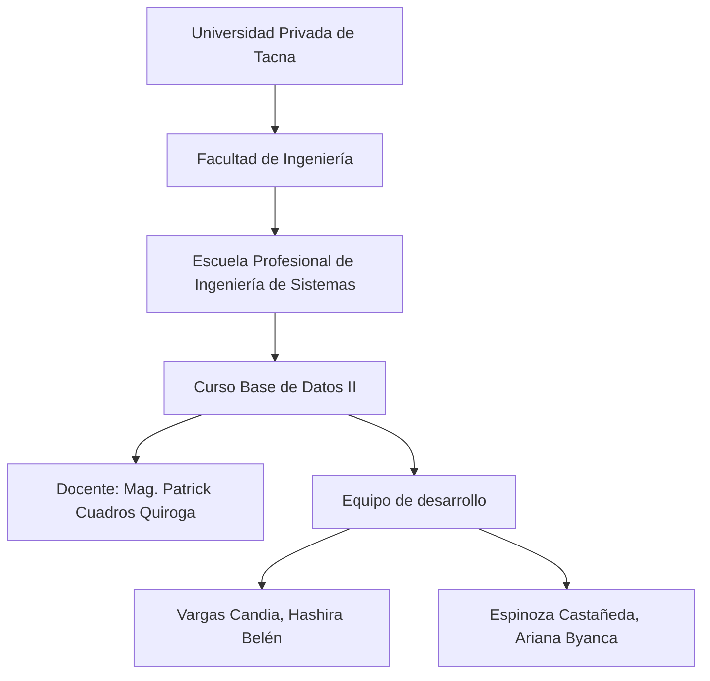

\pagebreak

# **II. Visionamiento de la Empresa**

## 1. Descripción del Problema

La necesidad principal consiste en supervisar de manera centralizada múltiples motores de bases de datos y el servidor anfitrión, evitando la dispersión de información entre herramientas diferentes. La supervisión manual retrasa la detección de saturación de conexiones, degradación de rendimiento, consumo de recursos y revisión de archivos relevantes del motor.

## 2. Objetivos de Negocios

- Reducir el esfuerzo manual de monitoreo.
- Centralizar métricas y alertas en una única interfaz.
- Mejorar la trazabilidad histórica del comportamiento de las bases de datos.
- Incrementar la capacidad de reacción ante incidentes.
- Fortalecer el valor académico del proyecto.

## 3. Objetivos de Diseño

- Construir una aplicación web ligera y modular.
- Utilizar Flask como base del backend.
- Implementar autenticación por roles.
- Permitir consultas diferenciadas por usuario.
- Mantener compatibilidad con PostgreSQL, MySQL, MariaDB, SQL Server y MongoDB.

## 4. Alcance del Proyecto

El proyecto contempla autenticación, gestión de datasources, recolección automática de métricas, historial, alertas, inventario de archivos, panel de administración y exportación a CSV. No incluye mensajería externa, ejecución de consultas ad hoc ni modificación remota de configuración del motor.

## 5. Viabilidad del Sistema

La viabilidad es alta porque la solución está construida con tecnologías abiertas y maduras, requiere infraestructura modesta, separa claramente la lógica de aplicación y permite el monitoreo de fuentes heterogéneas sin licencias comerciales.

## 6. Información obtenida del Levantamiento de Información

Del análisis del repositorio se obtuvo que el sistema:

- usa roles `admin`, `user` y `viewer`;
- almacena métricas de conexiones, cache hit ratio, CPU, memoria y estado;
- genera alertas por umbrales;
- conserva snapshots históricos;
- administra datasources por usuario;
- consulta archivos de configuración, datos, logs y backups.

\pagebreak

# **III. Análisis de Procesos**

## a) Diagrama del Proceso Actual – Diagrama de actividades

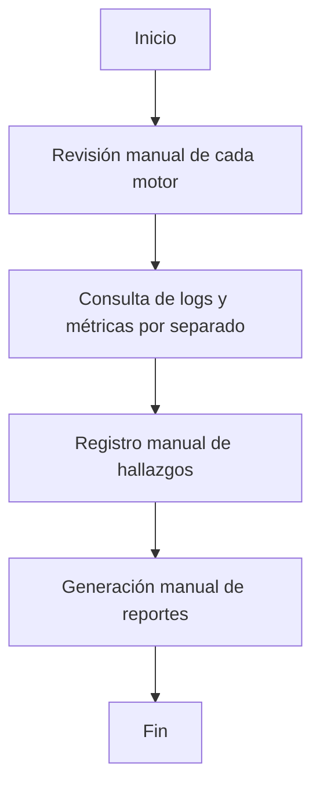

## b) Diagrama del Proceso Propuesto – Diagrama de actividades inicial

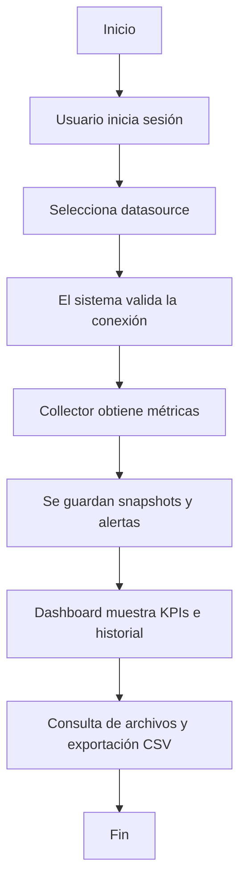

\pagebreak

# **IV. Especificación de Requerimientos de Software**

## a) Cuadro de Requerimientos Funcionales Inicial

| ID | Requerimiento | Descripción |
|---|---|---|
| RF-01 | Autenticación | Permitir registro, inicio y cierre de sesión. |
| RF-02 | Gestión de roles | Diferenciar admin, user y viewer. |
| RF-03 | Registro de datasources | Crear fuentes de datos con parámetros de conexión. |
| RF-04 | Prueba de conexión | Verificar conectividad a cada datasource. |
| RF-05 | Recolección automática | Obtener métricas de forma periódica. |
| RF-06 | Historial | Consultar snapshots históricos. |
| RF-07 | Alertas | Generar y consultar alertas por umbral. |
| RF-08 | Archivos | Mostrar archivos de configuración, datos, logs y backups. |
| RF-09 | Administración | Visualizar usuarios y fuentes para el rol admin. |
| RF-10 | CSV | Exportar información relevante. |

## b) Cuadro de Requerimientos No Funcionales

| ID | Requerimiento | Descripción |
|---|---|---|
| RNF-01 | Rendimiento | Respuesta ágil del dashboard y de los endpoints. |
| RNF-02 | Disponibilidad | Operación continua durante el semestre 2026-I. |
| RNF-03 | Seguridad | Hashing de contraseñas y control por sesión. |
| RNF-04 | Usabilidad | Interfaz clara para usuarios con conocimientos básicos. |
| RNF-05 | Portabilidad | Ejecución en Linux y navegadores modernos. |
| RNF-06 | Mantenibilidad | Código modular y configuración externa. |
| RNF-07 | Compatibilidad | Soporte para motores PostgreSQL, MySQL, MariaDB, SQL Server y MongoDB. |
| RNF-08 | Escalabilidad | Posibilidad de agregar más datasources sin rediseño completo. |

## c) Cuadro de Requerimientos Funcionales Final

| ID | Requerimiento | Prioridad | Estado |
|---|---|---|---|
| RF-01 | Autenticación | Alta | Implementado |
| RF-02 | Gestión de roles | Alta | Implementado |
| RF-03 | Registro de datasources | Alta | Implementado |
| RF-04 | Prueba de conexión | Alta | Implementado |
| RF-05 | Recolección automática | Crítica | Implementado |
| RF-06 | Historial | Alta | Implementado |
| RF-07 | Alertas | Alta | Implementado |
| RF-08 | Archivos | Media | Implementado |
| RF-09 | Administración | Media | Implementado |
| RF-10 | CSV | Media | Implementado |

## d) Reglas de Negocio

| ID | Regla de Negocio | Descripción |
|---|---|---|
| RN-01 | Acceso autenticado | Ningún usuario puede ingresar sin iniciar sesión. |
| RN-02 | Aislamiento por propietario | Cada usuario visualiza solo sus datasources, salvo admin. |
| RN-03 | Datasource activo | Solo las fuentes activas se monitorean automáticamente. |
| RN-04 | Evaluación de umbrales | El sistema genera alertas si se exceden o caen los valores configurados. |
| RN-05 | Contraseñas seguras | Las credenciales de usuario se almacenan con hash seguro. |
| RN-06 | Visibilidad global del admin | El administrador tiene acceso a usuarios y fuentes de todo el sistema. |
| RN-07 | Inventario por tipo de BD | Los archivos mostrados dependen del tipo de datasource. |

\pagebreak

# **V. Fase de Desarrollo**

## 1. Perfiles de Usuario

| Perfil | Descripción | Responsabilidades |
|---|---|---|
| Administrador | Usuario con visibilidad completa del sistema. | Gestionar usuarios, datasources, alertas y estado global. |
| Usuario estándar | Usuario que administra sus propias fuentes de datos. | Registrar datasources, monitorear métricas y revisar alertas. |
| Visor | Usuario de solo lectura. | Consultar métricas, alertas e historial. |

## 2. Modelo Conceptual

### Diagrama de Paquetes

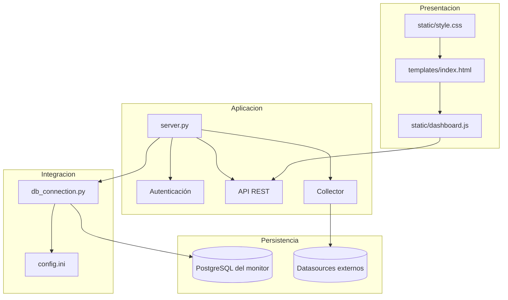

### Diagrama de Casos de Uso

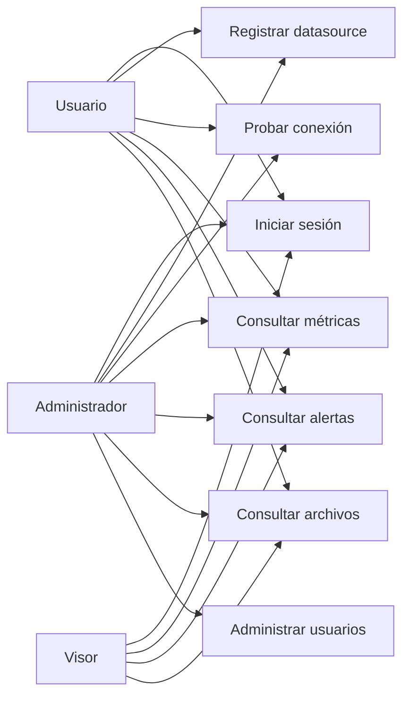

### Escenarios de Caso de Uso (narrativa) — CU-1 a CU-7

**CU-1 Iniciar sesión**

| Campo | Descripción |
|---|---|
| Actor principal | Usuario |
| Propósito | Autenticarse para acceder al sistema. |
| Flujo principal | 1. El usuario ingresa credenciales. 2. El sistema valida usuario y contraseña. 3. El sistema crea la sesión. 4. Se muestra el dashboard. |
| Flujo alterno | Si las credenciales son inválidas, el sistema rechaza el acceso. |

**CU-2 Registrar datasource**

| Campo | Descripción |
|---|---|
| Actor principal | Usuario / Administrador |
| Propósito | Crear una nueva fuente de datos. |
| Flujo principal | 1. El usuario completa nombre, tipo, host, puerto, usuario y base. 2. El sistema valida los datos. 3. Se almacena el datasource. |
| Flujo alterno | Si faltan campos, el sistema informa el error. |

**CU-3 Probar conexión**

| Campo | Descripción |
|---|---|
| Actor principal | Usuario / Administrador |
| Propósito | Verificar que la fuente de datos sea accesible. |
| Flujo principal | 1. El usuario selecciona Probar. 2. El sistema conecta al datasource. 3. El sistema devuelve latencia y estado. |
| Flujo alterno | Si falla la conexión, el sistema retorna el mensaje de error. |

**CU-4 Consultar métricas**

| Campo | Descripción |
|---|---|
| Actor principal | Todos los roles autenticados |
| Propósito | Revisar indicadores actuales. |
| Flujo principal | 1. El usuario abre el dashboard. 2. El sistema entrega el último snapshot o métricas en caché. 3. Se muestran KPIs y gráficos. |

**CU-5 Consultar alertas**

| Campo | Descripción |
|---|---|
| Actor principal | Usuario / Administrador / Visor |
| Propósito | Ver alertas recientes o históricas. |
| Flujo principal | 1. El usuario abre la sección de alertas. 2. El sistema consulta `alert_log`. 3. Se muestran severidad, métrica y mensaje. |

**CU-6 Consultar archivos**

| Campo | Descripción |
|---|---|
| Actor principal | Usuario / Administrador / Visor |
| Propósito | Revisar archivos de configuración, datos, logs y backups. |
| Flujo principal | 1. El usuario selecciona un datasource. 2. El sistema identifica rutas por tipo de BD. 3. El sistema muestra existencia, tamaño y fecha. |

**CU-7 Administrar usuarios**

| Campo | Descripción |
|---|---|
| Actor principal | Administrador |
| Propósito | Supervisar cuentas y fuentes globales. |
| Flujo principal | 1. El administrador accede al panel de administración. 2. El sistema muestra usuarios y datasources. 3. El administrador revisa la información. |

### Diagrama de Secuencia (vista de diseño)

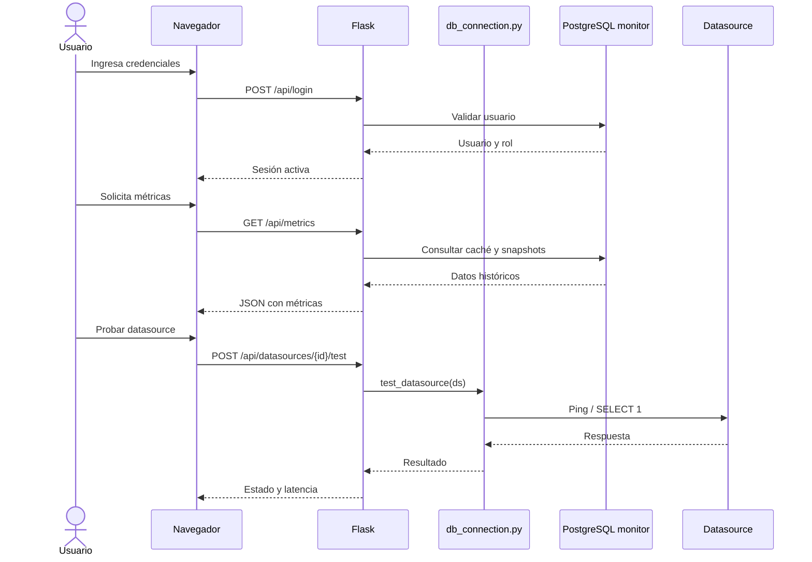

### Diagrama de Colaboración (vista de diseño)

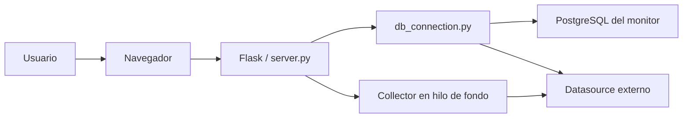

### Diagrama de Objetos

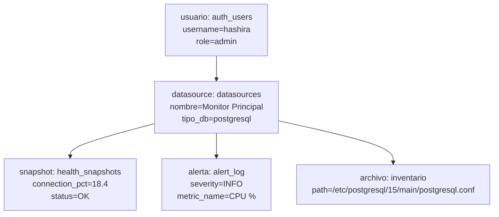

### Diagrama de Clases

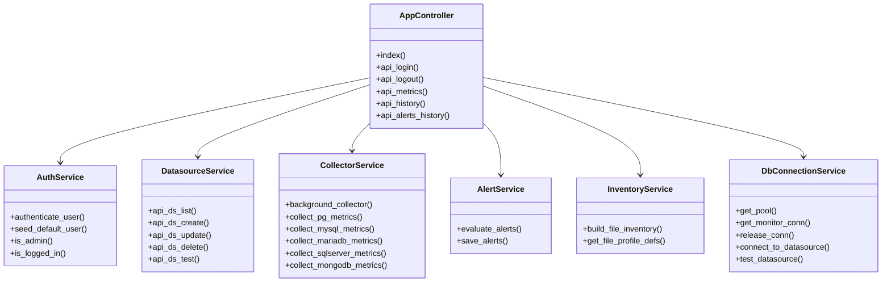

## 3. Modelo Lógico

### Análisis de Objetos

| Objeto | Descripción |
|---|---|
| Usuario | Persona autenticada con rol admin, user o viewer. |
| Datasource | Fuente de datos registrada para monitoreo. |
| Snapshot | Captura histórica de métricas del datasource. |
| Alerta | Evento generado por umbral superado o incumplido. |
| Archivo | Ruta asociada a configuración, datos, logs o backup. |

### Diagrama de Actividades con Objetos

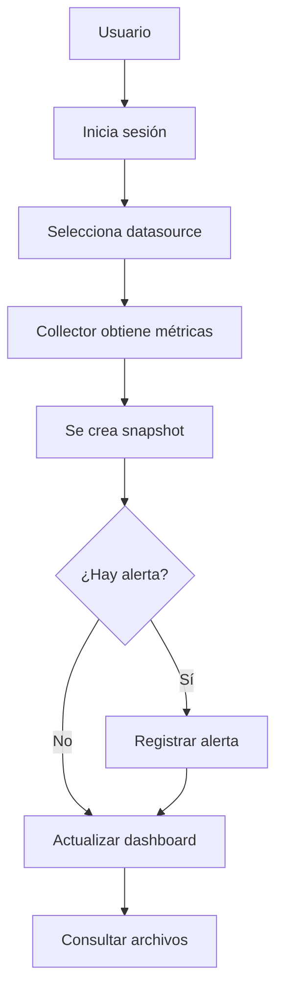

### c. Diagrama de Secuencia

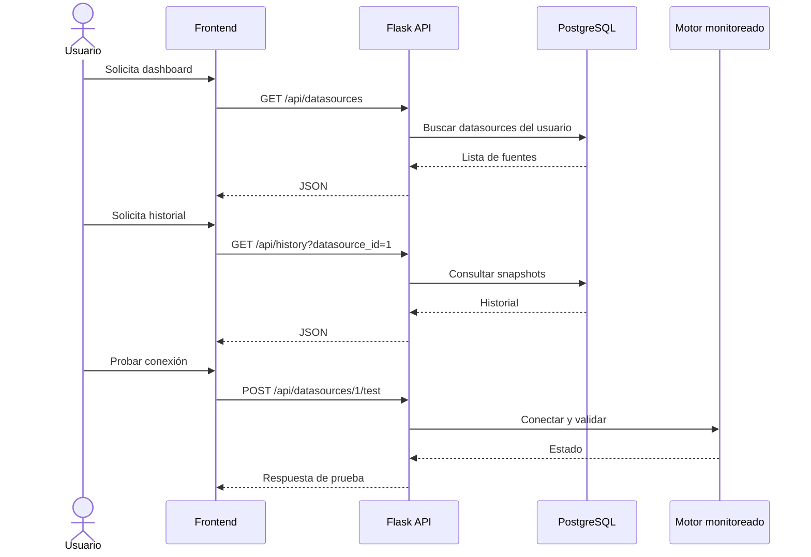

### d. Diagrama de Clases

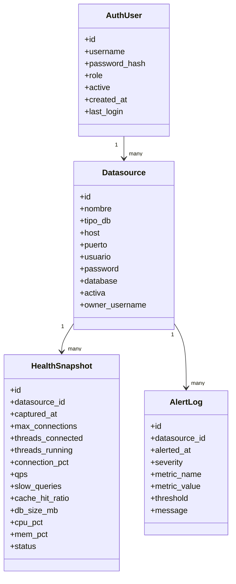

\pagebreak

# **Conclusiones**

DB Health Monitor queda formalmente especificado como una solución académica de monitoreo centralizado de bases de datos, con una arquitectura clara, un modelo lógico definido y una interfaz web adecuada para supervisión y análisis histórico.

# **Recomendaciones**

- Mantener el código y la documentación sincronizados ante cualquier cambio funcional.
- Incorporar futuras mejoras de seguridad para credenciales de datasource.
- Validar los diagramas y la narrativa con el docente antes de la entrega final.

# **Bibliografía**

1. Documentación oficial de Flask. https://flask.palletsprojects.com/
2. Documentación oficial de PostgreSQL. https://www.postgresql.org/docs/
3. Documentación de psutil. https://psutil.readthedocs.io/
4. Documentación de Chart.js. https://www.chartjs.org/docs/
5. IEEE Std 830-1998. *Software Requirements Specifications*.

# **Webgrafía**

1. README.md del proyecto.
2. `server.py` del proyecto.
3. `db_connection.py` del proyecto.
4. `config.ini` del proyecto.
5. `migrations/init.sql` del proyecto.
