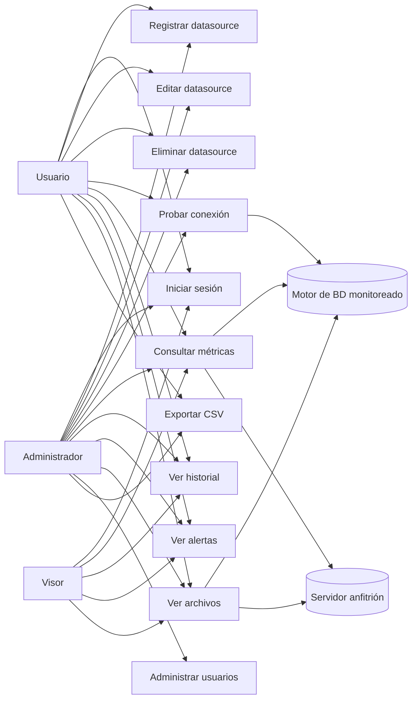
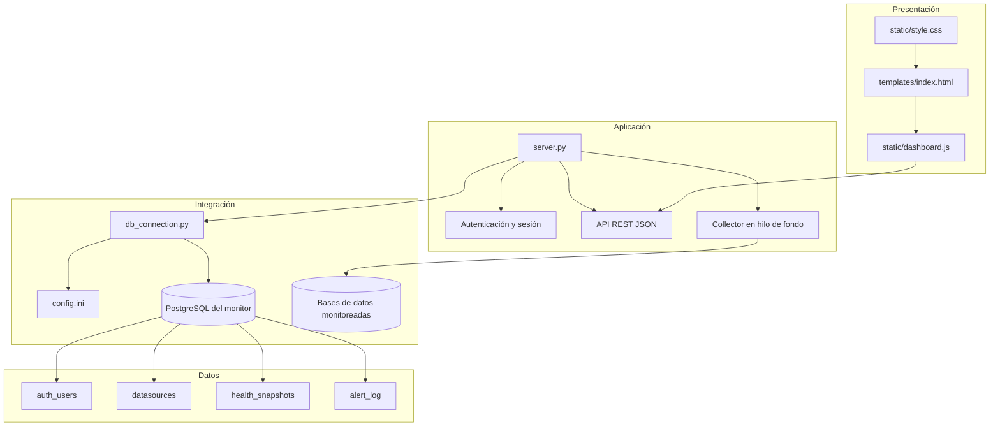
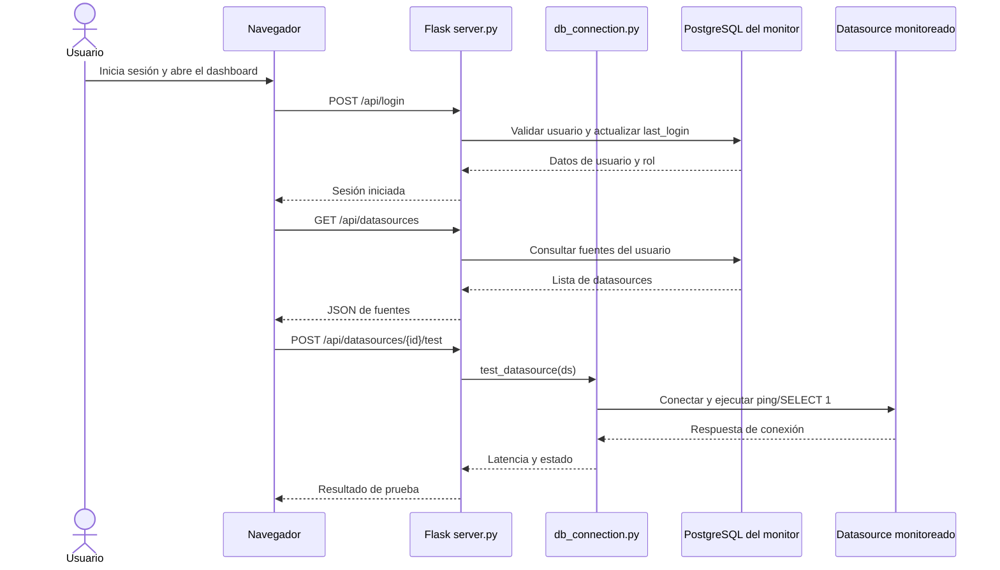
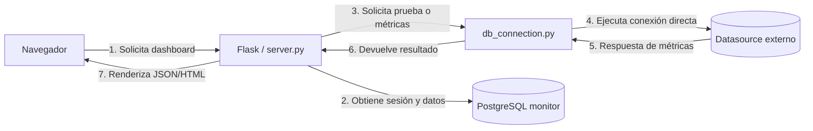
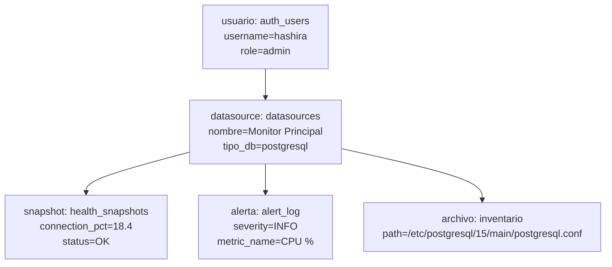
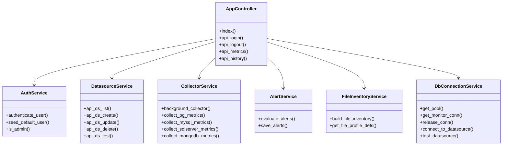
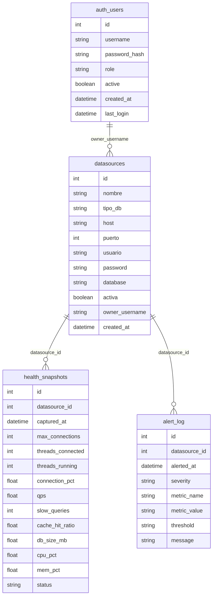
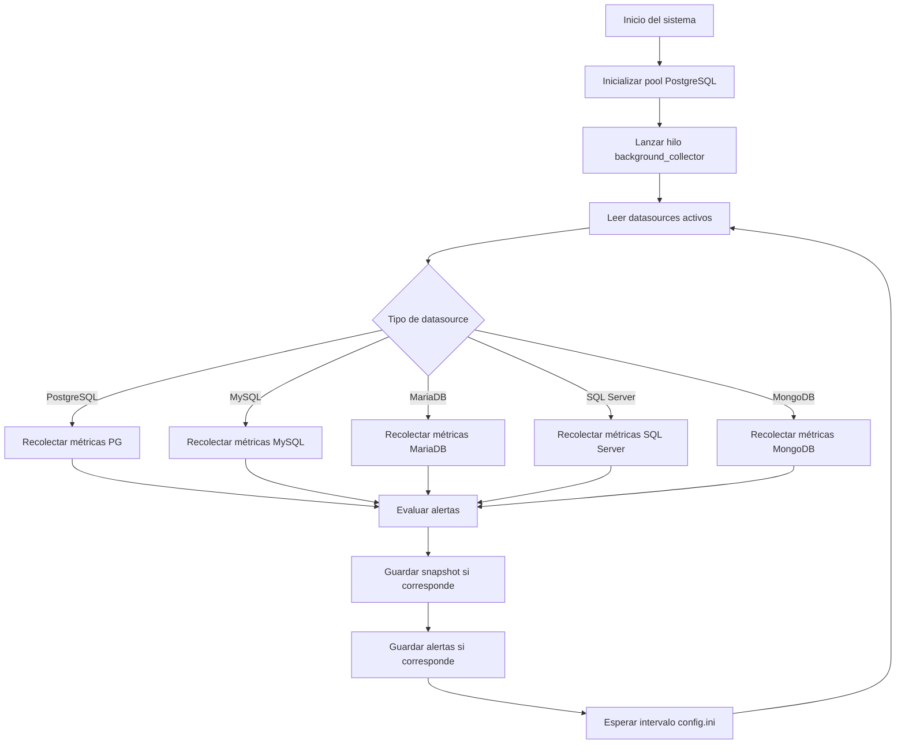
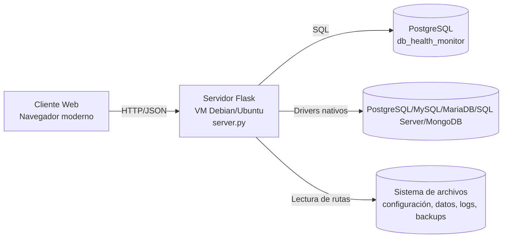

**UNIVERSIDAD PRIVADA DE TACNA**

**FACULTAD DE INGENIERIA**

**Escuela Profesional de Ingeniería de Sistemas**

**Proyecto *Monitor de Salud de Bases de Datos (DB Health Monitor)***

Curso: *Base de Datos II*

Docente: *Mag. Patrick Cuadros Quiroga*

Integrantes:

***Vargas Candia, Hashira Belén (2022075480)***
***Espinoza Castañeda, Ariana Byanca (2022073904)***

**Tacna – Perú**

***2026***

**  
**

\pagebreak

|CONTROL DE VERSIONES||||||
| :-: | :- | :- | :- | :- | :- |
|Versión|Hecha por|Revisada por|Aprobada por|Fecha|Motivo|
|1.0|HVC|AEC|PCQ|04/07/2026|Versión inicial del informe de arquitectura de software|

\pagebreak

# **1. INTRODUCCIÓN**

El presente informe de arquitectura de software describe la estructura técnica de **DB Health Monitor**, una aplicación web desarrollada en Python con Flask para monitorear el estado de salud de múltiples motores de bases de datos y del servidor anfitrión. El documento organiza la solución en vistas arquitectónicas que permiten entender el sistema desde el punto de vista funcional, lógico, de implementación, de procesos y de despliegue.

La arquitectura se definió a partir del código fuente del proyecto, la interfaz web, el archivo de configuración, el esquema de base de datos y la documentación académica del repositorio. La propuesta está alineada con el desarrollo realizado durante el semestre 2026-I del curso Base de Datos II.

El sistema adopta una arquitectura web de tres capas con persistencia centralizada en PostgreSQL para el monitor y conexiones dinámicas a motores heterogéneos mediante drivers específicos. Esta decisión permite mantener un diseño modular, escalable y coherente con el alcance académico del proyecto.

\pagebreak

# **2. OBJETIVOS Y RESTRICCIONES ARQUITECTÓNICAS**

## 2.1. Priorización de requerimientos

La priorización de requerimientos se estableció con base en su impacto sobre la operación central del sistema, su valor para el usuario final y su dependencia con el resto de componentes arquitectónicos.

### 1.1.1. Requerimientos Funcionales

| Prioridad | Requerimiento | Justificación arquitectónica |
|---|---|---|
| Crítica | Autenticación de usuarios | La arquitectura necesita controlar el acceso a todas las rutas protegidas y filtrar la información por sesión y rol. |
| Crítica | Recolección automática de métricas | Es la funcionalidad principal del sistema; sin este proceso no existe monitoreo continuo. |
| Alta | Gestión de datasource | Permite registrar, editar, eliminar y probar conexiones a las fuentes monitoreadas. |
| Alta | Historial de snapshots | Da soporte al análisis temporal y a la trazabilidad de la información. |
| Alta | Sistema de alertas | Habilita la detección proactiva de anomalías de conexión, CPU y memoria. |
| Alta | Dashboard web | Es la capa principal de interacción entre el usuario y los servicios del backend. |
| Media | Inventario de archivos | Complementa la visión operativa, pero no afecta el ciclo principal de monitoreo. |
| Media | Panel de administración | Permite supervisión global, aunque no es indispensable para el flujo básico. |
| Media | Exportación a CSV | Soporta análisis externo y presentación de resultados. |

### 1.1.2. Requerimientos No Funcionales – Atributos de Calidad

| Atributo | Prioridad | Criterio arquitectónico |
|---|---|---|
| Seguridad | Crítica | Uso de sesiones, control de acceso por rol y hashing seguro de contraseñas de usuario. |
| Confiabilidad | Crítica | El collector corre en hilo de fondo y las operaciones de persistencia usan manejo de errores y reintentos. |
| Rendimiento | Alta | El dashboard consume datos desde caché local en memoria y el monitoreo se actualiza cada 10 segundos. |
| Mantenibilidad | Alta | La solución separa backend, capa de conexión, frontend y archivos de configuración. |
| Usabilidad | Alta | Interfaz visual con KPIs, tablas y gráficos interpretables sin entrenamiento complejo. |
| Portabilidad | Media | Despliegue posible en Debian/Ubuntu y navegadores modernos sin dependencias propietarias. |
| Escalabilidad | Media | La solución puede incorporar nuevas fuentes de datos y extenderse por módulos. |

## 2.2. Restricciones

Las restricciones arquitectónicas del sistema son las siguientes:

- El backend debe implementarse en Python 3.10 o superior.
- El framework base del servidor es Flask.
- La base de datos del monitor debe ser PostgreSQL.
- La solución debe usar drivers nativos para conectar a PostgreSQL, MySQL, MariaDB, SQL Server y MongoDB.
- La interfaz debe ejecutarse en navegadores modernos sin complementos adicionales.
- El sistema debe funcionar con acceso a red hacia las fuentes monitoreadas.
- El monitoreo debe operar con un intervalo configurable definido en `config.ini`.
- El proyecto se desarrolló como entrega académica del semestre 2026-I, por lo que la arquitectura privilegia simplicidad, claridad y bajo costo de despliegue.
- El sistema debe conservar compatibilidad con el almacenamiento de credenciales de usuario mediante hash seguro y con el almacenamiento de credenciales de datasource bajo la política actual del proyecto.

\pagebreak

# **3. REPRESENTACIÓN DE LA ARQUITECTURA DEL SISTEMA**

## 3.1. Vista de Caso de uso

La vista de casos de uso identifica a los actores principales del sistema y las interacciones que sostienen el monitoreo, la administración y la consulta de información.

### 3.1.1. Diagramas de Casos de uso

## 3.2. Vista Lógica

La vista lógica muestra cómo se agrupan las responsabilidades del sistema en subsistemas y clases lógicas coherentes con la implementación actual.

### 3.2.1. Diagrama de Subsistemas (paquetes)

### 3.2.2. Diagrama de Secuencia (vista de diseño)

### 3.2.3. Diagrama de Colaboración (vista de diseño)

### 3.2.4. Diagrama de Objetos

### 3.2.5. Diagrama de Clases

### 3.2.6. Diagrama de Base de datos (relacional o no relacional)

## 3.3. Vista de Implementación (vista de desarrollo)

La vista de implementación refleja los archivos y módulos reales del proyecto:

| Componente | Archivo | Responsabilidad |
|---|---|---|
| Servidor principal | `server.py` | Expone rutas, autenticación, collector, alertas y API REST. |
| Conexión a datos | `db_connection.py` | Administra el pool PostgreSQL y las conexiones a datasources externos. |
| Interfaz HTML | `templates/index.html` | Define la estructura de la interfaz web. |
| Lógica frontend | `static/dashboard.js` | Consume APIs, actualiza el dashboard y administra la experiencia de usuario. |
| Estilos | `static/style.css` | Define la presentación visual responsive. |
| Configuración | `config.ini` | Contiene intervalos, credenciales bootstrap, umbrales y rutas de archivos. |
| Esquema SQL | `migrations/init.sql` | Inicializa tablas e índices del monitor. |

La implementación sigue un enfoque monolítico modular: la presentación se sirve desde Flask, el frontend consume endpoints JSON y la persistencia se centraliza en PostgreSQL. Los motores de bases de datos monitoreados se consultan mediante conexiones directas y drivers específicos.

## 3.4. Vista de procesos

La vista de procesos describe el comportamiento concurrente del sistema: el usuario interactúa con el dashboard mientras un hilo de fondo recolecta y persiste métricas periódicamente.

### 3.4.1. Diagrama de Procesos del sistema (diagrama de actividad)

## 3.5. Vista de Despliegue (vista física)

La vista de despliegue ubica físicamente los principales nodos del sistema y su relación de red.

### 3.5.1. Diagrama de despliegue

\pagebreak

# **4. ATRIBUTOS DE CALIDAD DEL SOFTWARE**

## Escenario de Funcionalidad

**Fuente del estímulo:** usuario autenticado que consulta una fuente de datos.

**Estímulo:** el usuario solicita las métricas de un datasource activo desde el dashboard.

**Artefacto:** `server.py`, `db_connection.py`, tablas `health_snapshots` y `datasources`.

**Entorno:** navegador web conectado al servidor Flask y a PostgreSQL.

**Respuesta esperada:** el sistema debe responder con métricas vigentes, estado global, historial y alertas asociadas al datasource seleccionado.

**Medida de respuesta:** la información debe mostrarse de forma consistente y sin mezclar datos de otro usuario.

## Escenario de Usabilidad

**Fuente del estímulo:** usuario estándar con conocimientos básicos de bases de datos.

**Estímulo:** el usuario registra un datasource y navega por los módulos del dashboard.

**Artefacto:** interfaz HTML/CSS/JS y panel visual.

**Entorno:** escritorio o laptop con navegador moderno.

**Respuesta esperada:** el usuario entiende la estructura del sistema, puede registrar una fuente y consultar métricas sin capacitación extensa.

**Medida de respuesta:** la interacción principal debe completarse en pocos pasos y con etiquetas claras.

## Escenario de confiabilidad

**Fuente del estímulo:** el collector ejecuta una lectura periódica y una base de datos está temporalmente no disponible.

**Estímulo:** falla temporal de conexión a una fuente monitoreada.

**Artefacto:** `background_collector()`, `connect_to_datasource()`, `test_datasource()`.

**Entorno:** ejecución continua en la VM del monitor.

**Respuesta esperada:** el sistema registra el error, mantiene vivo el servicio y continúa con las demás fuentes activas.

**Medida de respuesta:** el monitoreo no debe detener el proceso global por la caída de una sola fuente.

## Escenario de rendimiento

**Fuente del estímulo:** múltiples usuarios consultan métricas mientras el collector está activo.

**Estímulo:** acceso concurrente a endpoints como `/api/metrics`, `/api/history` y `/api/alerts/history`.

**Artefacto:** API REST, caché en memoria y PostgreSQL.

**Entorno:** 10 o más consultas simultáneas sobre un conjunto pequeño de datasources.

**Respuesta esperada:** el sistema responde en tiempos adecuados para uso interactivo y mantiene la actualización cada 10 segundos.

**Medida de respuesta:** el usuario observa refresco fluido del dashboard sin degradación notable en la navegación.

## Escenario de mantenibilidad

**Fuente del estímulo:** se requiere agregar un nuevo tipo de métrica o ajustar rutas de archivos.

**Estímulo:** el desarrollador modifica un módulo de backend o el archivo `config.ini`.

**Artefacto:** `server.py`, `db_connection.py`, `config.ini`.

**Entorno:** entorno de desarrollo local.

**Respuesta esperada:** el cambio se realiza en un módulo acotado, con bajo impacto en el resto del sistema.

**Medida de respuesta:** la extensión del sistema no requiere reescritura completa ni cambios transversales mayores.

## Otros Escenarios

- **Seguridad:** el sistema rechaza accesos no autenticados y restringe el alcance de los datos por rol.
- **Portabilidad:** la solución puede ejecutarse en una VM Debian con despliegue de producción mediante Gunicorn.
- **Escalabilidad:** pueden incorporarse más datasources siguiendo el mismo contrato de conexión.
- **Trazabilidad:** snapshots y alertas quedan almacenados en PostgreSQL para consulta histórica.

\pagebreak

# **Conclusiones**

DB Health Monitor presenta una arquitectura coherente con su propósito académico y técnico. La organización en vistas permite observar cómo el sistema resuelve el monitoreo centralizado de múltiples motores de base de datos, el manejo de alertas, el historial de métricas y la gestión por roles.

La arquitectura seleccionada es consistente con el código real del proyecto: Flask como núcleo del backend, PostgreSQL como base del monitor, drivers específicos para cada motor, una interfaz web responsiva y un proceso en segundo plano para la recolección de métricas.

# **Recomendaciones**

- Mantener la separación entre presentación, lógica de negocio, acceso a datos y configuración.
- Considerar en una versión futura el cifrado de credenciales de datasource en reposo.
- Agregar notificaciones externas cuando el proyecto evolucione fuera del entorno académico.
- Documentar nuevas clases o módulos si se amplía el soporte a más motores o métricas.

# **Bibliografía**

1. Grinberg, M. (2018). *Flask Web Development*.
2. Lutz, M. (2013). *Learning Python*.
3. Documentación oficial de Flask. https://flask.palletsprojects.com/
4. Documentación oficial de PostgreSQL. https://www.postgresql.org/docs/
5. Documentación de psutil. https://psutil.readthedocs.io/
6. Documentación de Chart.js. https://www.chartjs.org/docs/
7. IEEE Std 1471. *Recommended Practice for Architectural Description of Software-Intensive Systems*.

# **Webgrafía**

1. README.md del proyecto.
2. `config.ini` del proyecto.
3. Flask Documentation. https://flask.palletsprojects.com/
4. PostgreSQL Documentation. https://www.postgresql.org/docs/
5. psutil Documentation. https://psutil.readthedocs.io/
6. Chart.js Documentation. https://www.chartjs.org/docs/
