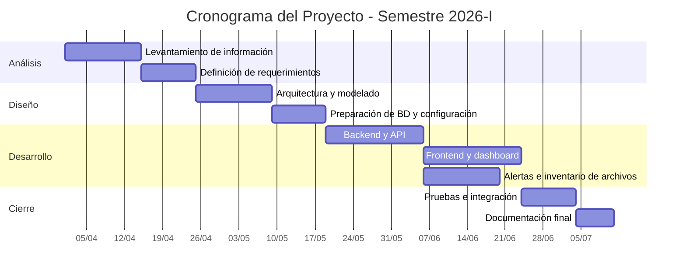

**UNIVERSIDAD PRIVADA DE TACNA**

**FACULTAD DE INGENIERIA**

**Escuela Profesional de Ingeniería de Sistemas**

**Proyecto *Monitor de Salud de Bases de Datos (DB Health Monitor)***

Curso: *Base de Datos II*

Docente: *Mag. Patrick Cuadros Quiroga*

Integrantes:

***Vargas Candia, Hashira Belén (2022075480)***
***Espinoza Castañeda, Ariana Byanca (2022073904)***

**Tacna – Perú**

***2026***

**  
**

\pagebreak

|CONTROL DE VERSIONES||||||
| :-: | :- | :- | :- | :- | :- |
|Versión|Hecha por|Revisada por|Aprobada por|Fecha|Motivo|
|1.0|HVC|AEC|PCQ|04/07/2026|Versión inicial del informe de proyecto final|

\pagebreak

# **ÍNDICE GENERAL**

1. Antecedentes

1.1. Contexto global

1.2. Problemática general

1.3. Solución propuesta

2. Planteamiento de problema

a. Problema central

b. Justificación

c. Alcance

3. Objetivos

4. Marco Teórico

5. Desarrollo de la Solución

a. Análisis de Factibilidad (técnico, económica, operativa, social, legal, ambiental)

b. Tecnología de Desarrollo

c. Metodología de implementación

6. Cronograma

7. Presupuesto

8. Conclusiones

Recomendaciones

Bibliografía

Anexos

Anexo 01 Informe de Factibilidad

Anexo 02 Documento de Visión

Anexo 03 Documento SRS

Anexo 04 Documento SAD

Anexo 05 Manuales y otros documentos

\pagebreak

# **1. ANTECEDENTES**

## 1.1. Contexto global

En entornos académicos, institucionales y empresariales es cada vez más frecuente administrar infraestructuras heterogéneas con varios motores de base de datos. Esta diversidad obliga a supervisar disponibilidad, uso de recursos, estado de conexiones, métricas de rendimiento y respaldos, a menudo utilizando herramientas aisladas por motor. Como resultado, el seguimiento se fragmenta y la respuesta ante incidentes se retrasa.

DB Health Monitor surge en ese contexto como una solución académica orientada a integrar la supervisión de PostgreSQL, MySQL, MariaDB, SQL Server y MongoDB en una sola interfaz, con almacenamiento histórico y alertas automáticas.

## 1.2. Problemática general

La problemática general consiste en la falta de una herramienta unificada para visualizar el estado de múltiples bases de datos y del servidor anfitrión desde un mismo panel. La revisión manual de métricas, logs y archivos de configuración consume tiempo y dificulta detectar a tiempo fallas de conexión, saturación de recursos o degradación del rendimiento.

En el proyecto se identificó además la necesidad de mantener trazabilidad histórica de métricas, controlar el acceso por usuario y disponer de un inventario de archivos por motor para una supervisión más completa.

## 1.3. Solución propuesta

Se propone desarrollar un sistema web denominado **DB Health Monitor** que permita:

- autenticación de usuarios;
- registro y prueba de fuentes de datos;
- recolección automática de métricas del host y de bases de datos;
- persistencia de snapshots históricos en PostgreSQL;
- generación y consulta de alertas;
- inventario de archivos de configuración, datos, logs y backups;
- visualización de KPIs y gráficos desde un dashboard responsive.

\pagebreak

# **2. PLANTEAMIENTO DE PROBLEMA**

## a. Problema central

El problema central es la ausencia de una plataforma centralizada que permita monitorear en tiempo real y con trazabilidad histórica el estado de múltiples motores de bases de datos, junto con los recursos del servidor donde se ejecuta el sistema.

## b. Justificación

El proyecto se justifica porque permite reducir el tiempo de supervisión manual, mejorar la detección temprana de incidentes y ofrecer una solución de bajo costo basada en software libre. Además, fortalece el aprendizaje en administración de bases de datos, desarrollo web y observabilidad de sistemas.

## c. Alcance

El alcance del proyecto comprende el desarrollo e implementación de un dashboard web con autenticación, monitoreo periódico, gestión de datasources, historial de métricas, alertas e inventario de archivos. El sistema no incluye notificaciones externas, edición remota de configuraciones de motores ni ejecución de consultas ad hoc sobre los servidores monitoreados.

\pagebreak

# **3. OBJETIVOS**

**Objetivo general**

Desarrollar e implementar un sistema web de monitoreo de salud de bases de datos que centralice la recolección, almacenamiento y visualización de métricas de múltiples motores de BD y del servidor anfitrión.

**Objetivos específicos**

- Implementar autenticación y control de acceso por roles.
- Recolectar métricas periódicas de PostgreSQL, MySQL, MariaDB, SQL Server y MongoDB.
- Almacenar snapshots históricos y alertas en PostgreSQL.
- Diseñar un dashboard interactivo para consulta de KPIs y gráficos.
- Incorporar un inventario de archivos de configuración, datos, logs y backups.
- Proporcionar exportación de información a CSV para análisis externo.

\pagebreak

# **4. MARCO TEÓRICO**

El sistema se apoya en conceptos de monitoreo de infraestructura, arquitectura web y gestión de datos.

**Monitoreo de bases de datos:** proceso de observación de métricas como conexiones activas, uso de CPU, memoria, tamaño de base de datos, actividad del motor y estado general.

**Arquitectura web:** organización del sistema en capas de presentación, lógica de negocio y persistencia, con consumo de API por parte del frontend.

**Control de acceso por roles:** mecanismo que limita la información y las acciones disponibles según el tipo de usuario autenticado.

**Persistencia de snapshots:** almacenamiento de capturas periódicas para análisis histórico y detección de tendencias.

**Alertamiento por umbrales:** técnica de evaluación que dispara alertas cuando una métrica supera o baja de valores configurados.

**Inventario de archivos:** inspección estructurada de archivos de configuración, datos, logs y respaldos asociados al motor de base de datos.

\pagebreak

# **5. DESARROLLO DE LA SOLUCIÓN**

## a. Análisis de Factibilidad (técnico, económica, operativa, social, legal, ambiental)

### Factibilidad técnica

La solución es técnicamente viable porque utiliza tecnologías maduras y accesibles: Python 3.10+, Flask, PostgreSQL, psutil, Chart.js y drivers nativos para cada motor soportado. El sistema puede ejecutarse en una VM Debian con recursos modestos y se adapta al contexto académico del semestre 2026-I.

### Factibilidad económica

El costo económico es reducido debido al uso de software libre. Los gastos reales corresponden principalmente a tiempo de desarrollo, pruebas y documentación. El aprovechamiento de infraestructura institucional evita costos de licenciamiento y reduce el presupuesto general.

### Factibilidad operativa

La operación es viable porque los usuarios solo requieren un navegador moderno. El flujo de uso es simple: autenticarse, registrar el datasource, consultar métricas, revisar alertas y exportar resultados. El mantenimiento puede ser asumido por un equipo pequeño.

### Factibilidad social

El sistema tiene impacto social positivo en el entorno académico, ya que promueve buenas prácticas de monitoreo, análisis de datos y administración responsable de bases de datos. Además, favorece el trabajo colaborativo y la cultura de observabilidad.

### Factibilidad legal

La solución no presenta conflicto legal para su uso académico siempre que se respeten las normas de protección de datos, seguridad de la información y uso autorizado de credenciales. El proyecto utiliza librerías de código abierto compatibles con su finalidad educativa.

### Factibilidad ambiental

El impacto ambiental es bajo porque el sistema digitaliza procesos de supervisión, reduce consumo de papel y evita desplazamientos innecesarios para revisar manualmente el estado de las bases de datos.

## b. Tecnología de Desarrollo

Las tecnologías empleadas son:

- Python 3.10+;
- Flask como framework principal;
- psycopg2 para PostgreSQL;
- mysql-connector-python para MySQL y MariaDB;
- pymssql para SQL Server;
- pymongo para MongoDB;
- psutil para métricas del sistema operativo;
- HTML5, CSS3 y JavaScript en la interfaz;
- Chart.js para visualización de gráficos;
- Gunicorn para despliegue en producción;
- PostgreSQL como base de datos del monitor.

## c. Metodología de implementación

La implementación siguió una metodología incremental orientada a prototipo funcional:

1. análisis del problema y definición de requerimientos;
2. diseño de la arquitectura del sistema;
3. implementación del backend Flask;
4. desarrollo de la interfaz visual;
5. integración con la base de datos del monitor;
6. validación de métricas, alertas y archivos;
7. pruebas y ajuste de configuración;
8. documentación y consolidación del entregable final.

\pagebreak

# **6. CRONOGRAMA**

El cronograma del proyecto abarcó el semestre 2026-I, con una ejecución continua durante aproximadamente 14 semanas.

\pagebreak

# **7. PRESUPUESTO**

El presupuesto se presenta en soles peruanos y considera un enfoque académico con infraestructura institucional disponible.

| Rubro | Costo |
|---|---:|
| Materiales y documentación | S/ 55.00 |
| Conectividad y energía | S/ 135.00 |
| Infraestructura / ambiente | S/ 0.00 |
| Desarrollo del sistema | S/ 5,600.00 |
| **Total estimado** | **S/ 5,790.00** |

La inversión no incluye licencias comerciales porque la solución se basa en herramientas open source. El costo del trabajo corresponde a la dedicación del equipo durante el semestre 2026-I.

\pagebreak

# **8. CONCLUSIONES**

DB Health Monitor constituye una solución factible, útil y coherente con el problema detectado. El sistema centraliza el monitoreo de múltiples motores de bases de datos, automatiza la recolección de métricas y proporciona información histórica y operativa a través de una interfaz web clara.

La arquitectura propuesta permite integrar backend, frontend, persistencia y monitoreo de archivos de forma modular, lo cual favorece su mantenimiento y evolución futura.

## Recomendaciones

- Mantener la documentación técnica alineada con el código fuente.
- Ampliar el sistema con notificaciones externas en futuras versiones.
- Considerar el cifrado de credenciales de datasource si el sistema evoluciona a producción.
- Ejecutar pruebas de carga si se incrementa el número de bases de datos monitoreadas.

## Bibliografía

1. Grinberg, M. *Flask Web Development*.
2. Lutz, M. *Learning Python*.
3. Documentación oficial de Flask: https://flask.palletsprojects.com/
4. Documentación oficial de PostgreSQL: https://www.postgresql.org/docs/
5. Documentación de psutil: https://psutil.readthedocs.io/
6. Documentación de Chart.js: https://www.chartjs.org/docs/

## Anexos

### Anexo 01 Informe de Factibilidad

Se adjunta el informe de factibilidad del proyecto como soporte del análisis técnico, económico, operativo, social, legal y ambiental.

### Anexo 02 Documento de Visión

Se adjunta el documento de visión para respaldar el alcance y los objetivos del sistema.

### Anexo 03 Documento SRS

Se adjunta la especificación de requerimientos como respaldo funcional y no funcional del sistema.

### Anexo 04 Documento SAD

Se adjunta el informe de arquitectura de software como respaldo estructural de la solución.

### Anexo 05 Manuales y otros documentos

Se adjuntan manuales de uso, archivos de configuración y documentación complementaria del proyecto.
