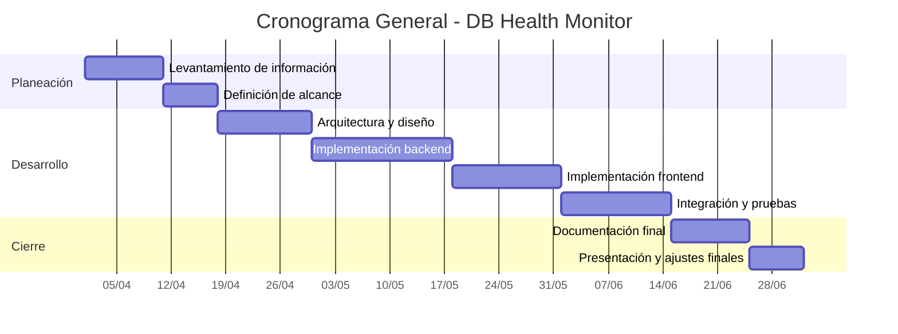

**UNIVERSIDAD PRIVADA DE TACNA**

**FACULTAD DE INGENIERIA**

**Escuela Profesional de Ingeniería de Sistemas**

**Proyecto *Monitor de Salud de Bases de Datos (DB Health Monitor)***

Curso: *Base de Datos II*

Docente: *Mag. Patrick Cuadros Quiroga*

Integrantes:

***Vargas Candia, Hashira Belén (2022075480)***
***Espinoza Castañeda, Ariana Byanca (2022073904)***

**Tacna – Perú**

***2026***

**  
**

\pagebreak

|CONTROL DE VERSIONES||||||
| :-: | :- | :- | :- | :- | :- |
|Versión|Hecha por|Revisada por|Aprobada por|Fecha|Motivo|
|1.0|HVC|AEC|PCQ|04/07/2026|Versión inicial de la propuesta de proyecto|

\pagebreak

# **Resumen Ejecutivo**

| **Nombre del Proyecto propuesto:** |
|---|
| *DB Health Monitor, Tacna 2026* |

| **Propósito del Proyecto y Resultados esperados:** |
|---|
| El propósito del proyecto es desarrollar una plataforma web que centralice el monitoreo de múltiples bases de datos y del servidor anfitrión, permitiendo visualizar métricas, alertas e inventario de archivos en un único panel. |
| Los resultados esperados son: |
| • Un dashboard funcional con autenticación, visualización de métricas y alertas automáticas. |
| • Historial de snapshots y exportación de datos para análisis académico. |
| • Gestión de datasources y consulta de archivos de configuración, datos, logs y backups. |

| **Población Objetivo:** |
|---|
| Docente del curso Base de Datos II, integrantes del equipo de desarrollo, administradores de bases de datos en entornos académicos y estudiantes que requieran supervisar motores de BD heterogéneos. |

| **Monto de Inversión (En Soles):** | **Duración del Proyecto (En Meses):** |
|---|---|
| **S/ 5,790.00** | **3.5 meses** |

\pagebreak

# **I. Propuesta narrativa**

## 1. Planteamiento del Problema

La supervisión de bases de datos heterogéneas suele estar fragmentada en múltiples herramientas, lo que dificulta contar con una visión integrada del rendimiento, la disponibilidad y el estado de archivos asociados a cada motor. En el contexto académico y técnico del proyecto, esto genera retrasos en la detección de incidencias y dificulta el seguimiento histórico de métricas.

## 2. Justificación del proyecto

El proyecto se justifica por la necesidad de centralizar el monitoreo de múltiples motores de BD en una sola plataforma, utilizando herramientas open source y un enfoque de bajo costo. También aporta valor académico al integrar conceptos de administración de bases de datos, desarrollo web, arquitectura de software y análisis de datos.

## 3. Objetivo general

Desarrollar e implementar un sistema web de monitoreo de salud de bases de datos que permita supervisar, almacenar y visualizar métricas de múltiples motores de BD y del servidor anfitrión.

## 4. Beneficios

- Reducción del tiempo de supervisión manual.
- Visibilidad centralizada del estado de múltiples motores.
- Alertas automáticas ante condiciones de riesgo.
- Historial de métricas para análisis comparativo.
- Valor académico y técnico para el equipo desarrollador.

## 5. Alcance

El sistema incluye autenticación, gestión de datasources, monitoreo automático, historial, alertas, panel de administración e inventario de archivos. No incluye notificaciones externas ni modificación remota de parámetros del motor.

## 6. Requerimientos del sistema

### Funcionales

- Iniciar sesión y cerrar sesión.
- Registrar, editar, eliminar y probar datasources.
- Monitorear métricas de PostgreSQL, MySQL, MariaDB, SQL Server y MongoDB.
- Consultar historial y alertas.
- Ver archivos de configuración, datos, logs y backups.
- Exportar información en CSV.

### No funcionales

- Seguridad por rol y sesión.
- Alta usabilidad en navegador moderno.
- Persistencia confiable de snapshots.
- Mantenibilidad mediante módulos separados.
- Compatibilidad con Linux y stack open source.

## 7. Restricciones

- Uso de Python 3.10+ y Flask.
- Base de datos del monitor en PostgreSQL.
- Conexión a motores heterogéneos mediante drivers nativos.
- Despliegue en VM con recursos limitados.
- Tiempo de desarrollo restringido al semestre 2026-I.

## 8. Supuestos

- Las fuentes de datos a monitorear estarán accesibles por red.
- El equipo contará con acceso a un entorno Debian/Ubuntu para pruebas.
- El sistema se utilizará en un contexto académico con infraestructura disponible.

## 9. Resultados esperados

- Una aplicación web operativa y demostrable.
- Métricas históricas y alertas persistentes.
- Dashboard visual para monitoreo y consulta.
- Documentación técnica completa para entrega académica.

## 10. Metodología de implementación

Se utilizó una metodología incremental: levantamiento de información, diseño, desarrollo del backend, desarrollo del frontend, integración, pruebas y documentación final.

## 11. Actores claves

- Docente del curso Base de Datos II.
- Equipo de desarrollo.
- Administrador del sistema.
- Usuario estándar.
- Visor de información.

## 12. Papel y responsabilidades del personal

| Rol | Responsabilidades |
|---|---|
| Docente | Revisión académica, validación de entregables y evaluación del avance. |
| Equipo de desarrollo | Diseño, implementación, pruebas, documentación y presentación final. |
| Administrador | Administración de usuarios, datasources y estado global del sistema. |
| Usuario estándar | Registro y monitoreo de sus propias fuentes de datos. |
| Visor | Consulta de información sin capacidad de modificación. |

## 13. Plan de monitoreo y evaluación

El monitoreo del proyecto se realiza mediante revisión periódica de avances, validación de funcionalidades implementadas, pruebas de conexión con motores de BD, revisión de métricas y evaluación del cumplimiento del cronograma del semestre 2026-I.

## 14. Cronograma del proyecto

## 15. Hitos de entregables

- Hito 1: levantamiento y análisis del problema.
- Hito 2: aprobación de visión y factibilidad.
- Hito 3: arquitectura y especificación de requerimientos.
- Hito 4: implementación funcional del sistema.
- Hito 5: documentación final y entrega del proyecto.

\pagebreak

# **II. Presupuesto**

## 1. Planteamiento de aplicación del presupuesto

El presupuesto se orienta a cubrir materiales, conectividad, energía y tiempo de desarrollo. Dado que el proyecto se ejecutó con recursos institucionales y herramientas open source, el costo financiero es reducido y controlable.

## 2. Presupuesto

| Rubro | Costo |
|---|---:|
| Materiales y documentación | S/ 55.00 |
| Conectividad y energía | S/ 135.00 |
| Infraestructura / ambiente | S/ 0.00 |
| Desarrollo del sistema | S/ 5,600.00 |
| **Total** | **S/ 5,790.00** |

## 3. Análisis de Factibilidad

La propuesta es factible porque utiliza tecnologías maduras y conocidas por el equipo, no requiere licencias comerciales y puede desplegarse en una VM con recursos limitados. La arquitectura modular favorece la implementación incremental y la validación por etapas.

## 4. Evaluación Financiera

| Indicador | Resultado |
|---|---|
| Relación Beneficio/Costo | 1.44 |
| VAN estimado | S/ 1,260.00 |
| TIR estimada | 34% |
| COK adoptado | 12% |

Con estos valores, la propuesta presenta una evaluación financiera favorable para su desarrollo en el marco académico.

\pagebreak

# **Anexo 01 – Requerimientos del Sistema DB Health Monitor**

## Requerimientos funcionales principales

- Autenticación de usuarios.
- Gestión de roles.
- Registro y prueba de datasources.
- Recolección automática de métricas.
- Historial de snapshots y alertas.
- Inventario de archivos de BD.
- Exportación a CSV.

## Requerimientos no funcionales principales

- Seguridad.
- Rendimiento.
- Usabilidad.
- Confiabilidad.
- Mantenibilidad.
- Portabilidad.

## Restricciones principales

- Python 3.10+.
- Flask.
- PostgreSQL para el monitor.
- Drivers nativos para cada motor monitoreado.
- Despliegue en entorno académico o infraestructura limitada.
